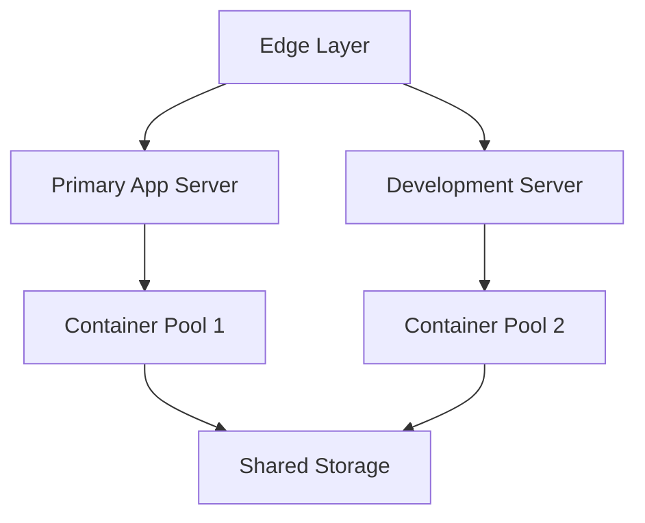

# Platform Engineering & Infrastructure Architecture Cheat Sheet - Addi-Aire

## System Architecture Overview

### Infrastructure Layers
```
┌─ Application Layer ─────────┐
│ - React Frontend           │
│ - API Services            │
│ - Static Assets           │
└──────────────────────────┘
┌─ Platform Layer ───────────┐
│ - Jenkins CI/CD           │
│ - Docker Registry         │
│ - Nginx Reverse Proxy     │
└──────────────────────────┘
┌─ Infrastructure Layer ─────┐
│ - ESXi Virtualization     │
│ - Docker Engine          │
│ - Ubuntu Server OS       │
└──────────────────────────┘
┌─ Network Layer ───────────┐
│ - Ubiquiti UDM Pro       │
│ - VLANs                  │
│ - Firewall Rules         │
└──────────────────────────┘
```

## Capacity Planning

### Compute Resources
- ESXi Host (192.168.2.236)
  - CPU: 16 cores
  - RAM: 32GB
  - Storage: 200GB
  
### Resource Allocation Matrix
```
Component         CPU     RAM     Storage   Network
─────────────────────────────────────────────────
Jenkins Master    2C      4GB     50GB      1Gbps
Docker Registry   1C      2GB     100GB     1Gbps
Nginx Proxy      1C      2GB     20GB      1Gbps
App Containers   4C      8GB     30GB      1Gbps
```

## Platform Components

### Core Services
1. Container Platform
   - Docker Engine
   - Private Registry
   - Image Storage

2. CI/CD Platform
   - Jenkins Master (192.168.3.26:8080)
   - Build Agents
   - Artifact Storage

3. Edge Services
   - Nginx Reverse Proxy
   - SSL Termination
   - Load Balancing

## Scalability Design

### Horizontal Scaling Points
```
Service          Scale Method          Limits
─────────────────────────────────────────────
App Containers   Docker Swarm         3-10 instances
Jenkins Agents   Dynamic Provision    1-5 agents
Nginx           Round-Robin LB       2 instances
Storage         LVM/ZFS Extension    Up to 2TB
```

### Vertical Scaling Capacity
```
Resource     Current    Max Capacity    Upgrade Path
───────────────────────────────────────────────────
CPU          16 cores   32 cores        Add CPUs
Memory       32GB       128GB           Add DIMMs
Storage      200GB      2TB             Add SSDs
Network      1Gbps      10Gbps          NIC Upgrade
```

## High Availability Design

### Service Distribution


### Failover Configuration
1. Primary Components
   - App Server: 192.168.3.26
   - Dev Server: 192.168.3.147
   - Shared Storage: NFS/iSCSI

2. Backup Components
   - VM Snapshots
   - Configuration Backups
   - Data Replication

## Storage Architecture

### Storage Hierarchy
```
┌─ Hot Storage ──────┐
│ SSDs for DBs      │
│ Container Images  │
└──────────────────┘
┌─ Warm Storage ────┐
│ Build Artifacts  │
│ Logs            │
└──────────────────┘
┌─ Cold Storage ────┐
│ Backups         │
│ Archives        │
└──────────────────┘
```

### Volume Management
```bash
# LVM Configuration
vgcreate data_vg /dev/sdb
lvcreate -L 100G -n docker_lv data_vg
mkfs.xfs /dev/data_vg/docker_lv

# Mount Points
/var/lib/docker    # Container runtime
/opt/registry      # Docker registry
/var/lib/jenkins   # Jenkins data
/backup            # System backups
```

## Network Architecture

### VLAN Design
```
VLAN ID    Purpose           Subnet
─────────────────────────────────────
10         Management        192.168.2.0/24
20         Production       192.168.3.0/24
30         Development     192.168.4.0/24
```

### Traffic Flow
```
External → UDM Pro → Nginx → Docker Networks → Containers
                   ↳ Jenkins → Build Agents
                   ↳ Management Network
```

## Security Architecture

### Security Layers
1. Network Security
   - VLAN Segregation
   - Firewall Rules
   - IDS/IPS

2. Platform Security
   - Container Isolation
   - Image Scanning
   - RBAC

3. Application Security
   - SSL/TLS
   - Secret Management
   - Access Control

### Secret Management
```yaml
Storage Locations:
  - Jenkins Credentials
  - GitHub Secrets
  - Docker Secrets
  - Vault (future)
```

## Monitoring Architecture

### Metrics Collection
```
┌─ Application Metrics ─┐
│ - Response Times     │
│ - Error Rates       │
│ - User Sessions     │
└────────────────────┘
┌─ Platform Metrics ───┐
│ - Container Stats   │
│ - Build Times      │
│ - Queue Lengths    │
└────────────────────┘
┌─ Infrastructure ────┐
│ - CPU/Memory       │
│ - Disk I/O        │
│ - Network         │
└────────────────────┘
```

### Monitoring Stack
- Prometheus: Metrics Collection
- Grafana: Visualization
- ELK: Log Aggregation
- Node Exporter: Host Metrics

## Disaster Recovery

### Recovery Objectives
- RPO: 24 hours
- RTO: 4 hours

### Recovery Components
1. System State
   - VM Snapshots
   - Configuration Backups
   - DNS Records

2. Application State
   - Container Images
   - Data Backups
   - SSL Certificates

3. Documentation
   - Recovery Procedures
   - Contact Information
   - Access Credentials

## Platform Evolution Path

### Near-term Improvements
- Container Orchestration (Docker Swarm/K8s)
- Service Mesh Implementation
- Automated Scaling
- CI/CD Pipeline Enhancement

### Future Considerations
- Multi-region Deployment
- Cloud Integration
- Zero-trust Security
- GitOps Implementation